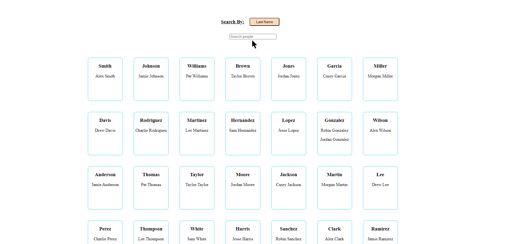

<a name="readme-top"></a>

<br />
<div align="center">
  <a href="https://github.com/marc-mccarthy/map-filter-search">
    
  </a>

  <h3 align="center">Map Filter Search</h3>

  <p align="center">
    Search by key for first or last name for persons in a database with [Map](https://developer.mozilla.org/en-US/docs/Web/JavaScript/Reference/Global_Objects/Map) in JavaScript. Built with [Vite](https://vitejs.dev/).
    <br />
    <a href="https://github.com/marc-mccarthy/map-filter-search"><strong>Explore the docs »</strong></a>
    <br />
    <br />
    <a href="https://github.com/marc-mccarthy/map-filter-search">View Demo</a>
    ·
    <a href="https://github.com/marc-mccarthy/map-filter-search/issues">Report Bug</a>
    ·
    <a href="https://github.com/marc-mccarthy/map-filter-search/issues">Request Feature</a>
  </p>
</div>

<details>
  <summary>Table of Contents</summary>
  <ol>
    <li>
      <a href="#about-the-project">About The Project</a>
    </li>
    <li>
      <a href="#github-setup">Github Setup</a>
    </li>
    <li>
      <a href="#local-setup">Local Setup</a>
    </li>
    <li>
      <a href="#instructions">Instructions</a>
    </li>
  </ol>
</details>


## About The Project



In collaborating with my friend [Pete](https://github.com/Pete-Hall), I had the opportunity to learn more about how [Map](https://developer.mozilla.org/en-US/docs/Web/JavaScript/Reference/Global_Objects/Map) works in JavaScript. I put together a little POC application to try and put to use what we learned.

This application has some [sample data](./data/sampleData.js) of persons in a database. Some have matching first or last names. Each group is stored as a key with the `fieldName` of "firstName" or "lastName". If you choose to search by first name, the keys shall look like:

```js
"Charlie" => [
  { firstName: "Charlie", lastName: "Rodriguez" },
  { firstName: "Charlie", lastName: "Perez" },
  // more names included in array
]
```

The search above is an example return if you search by `First Name` and you type in "Char". All keys that contain the search characters the users inputs on key press wil return.

Conversely, if you decide to search by `Last Name`, the keys returned to you in the Map would look like this given the same search of "Char":

```js
"Richardson" => [
  { firstName: "Taylor", lastName: "Richardson" },
]
```

"Char" (case-insensitive search) evaluates to "char" and the database compares all values in the lower case form. "Richardson" returns since it has "char" included in the key search.

<p align="right">(<a href="#readme-top">back to top</a>)</p>


## Github Setup

- [ ] **Create Repo from Use Template**:
  
  - Click [HERE](https://github.com/new?template_name=map-filter-search&template_owner=marc-mccarthy) or the `Use Template` button in this repo to create a new repo.
  - Ensure `Include all branches` is left unchecked.
  - Specify your username and repo name appropriately.
  - Provide a description for the repo (optional).
  - Set the repo as `Public`.
  - Click `Create repository`.

<p align="right">(<a href="#readme-top">back to top</a>)</p>


## Local Setup

- [ ] **Clone your Repo**:

  - Click the `<> Code` button in this repo and choose `SSH`.
  - Copy the URL. It should look something like: `git@github.com:YOUR-USERNAME/YOUR-REPO-NAME.git`.
  - In your terminal, navigate to the directory where you want to clone this repo.
  - Execute `git clone git@github.com:YOUR-USERNAME/YOUR-REPO-NAME.git`, replacing the placeholders with actual values.

- [ ] **Install Node Dependencies**:

  - In the terminal, navigate to the folder you cloned this repo and run the following based on your package manager preference:

    npm
    ```sh
    npm install
    ```
    
    pnpm
    ```sh
    pnpm install
    ```

<p align="right">(<a href="#readme-top">back to top</a>)</p>


## Instructions

- [ ] **Start the application**:

  - In a terminal, run the following to start the application:
    
    npm
    ```sh
    npm run dev
    ```
    
    pnpm
    ```sh
    npm run dev
    ```

The UI should open in your default web browser to the correct URL. If not, open [localhost:5173](http://localhost:5173) in your web browser.

> **NOTE:** The key combination `ctrl-c` will stop your application from running. Whichever current Node.js process is running in that terminal will stop on macOS.

<p align="right">(<a href="#readme-top">back to top</a>)</p>
